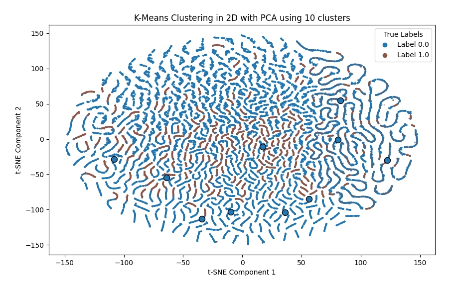

# Data Mining Project

**用户购买预测**

徐启鑫; 罗绍玮

## 数据分析, 预处理, 特征工程


### (不确定起什么名字)

（需要提到两个问题：label极度不平衡、存在大量的NaN。但因为效果确实好，且自划分的训练验证集和平台上的差异太大，故最后依然选用这种方法。）

### 时间滑窗

主要参考了网站上大部分人的实现：对一些字段进行类型转换从而减少内存，之后对 payment 以及 goods 构建对应的 customer 数据，之后用不同的天数对这些数据进行一个 min/median/max/mean 等的特征。

这相比上面的方法有一个优势就是，在构建 dataset 时只考虑到有交易成功的用户，而这些用户在完整的测试集里面只占了越47%。因此训练时间以及预测时都可以更快，占用的内存也更少，且训练时由噪声带来的影响也更低。

最终得到的训练集和测试集数据为：

```py
test shape: (681436, 59) train shape: (681436, 60)
label
0.0    512617
1.0    168819
```

可以看到虽然 label 也是很不平衡，但相比上面的方式已经比较平衡了，因为有效的数据在滑窗时数量增多了。

然而这方法只是在自己划分的训练/验证集上面有着能接受的结果，上传到网站上的 AUC 只有 ~0.5，还不如直接让他全猜 0。

## 预测模型

训练集和验证集的划分基本都是用特征工程后得到的 data 和 label，按比例`8:2`随机划分。我们选取了三种算法对数据进行拟合，分别是LightBGM, XGBBoost和K-Means。其中前两种算法均为掉包实现，K-Means则是自己编码实现。

### LightGBM

我们调用`lightgbm`包，对特征工程后的数据集进行拟合。
LightGBM（Light Gradient Boosting Machine）是一种基于梯度提升决策树（GBDT）算法的机器学习框架。与传统的 GBDT 算法不同，LightGBM 通过优化树的构建方式提高了训练速度和内存效率。它使用了直方图算法来加速训练过程，将连续特征分桶为离散区间，减少了计算复杂度。同时，LightGBM 采用了基于叶子节点的最佳分裂算法，而不是传统的按层级生长树的方式，这样能够提高模型的精度和效率。
我们的`LGBMClassifier`选取了如下参数：
```
clf = lgb.LGBMClassifier(
            num_leaves=2**5-1, reg_alpha=0.25, reg_lambda=0.25, objective='binary',
            max_depth=-1, learning_rate=0.005, min_child_samples=3, random_state=2021,
            n_estimators=2500, subsample=1, colsample_bytree=1,
        )
```
- 结果：在划分的测试集上达到了**0.71468**的AUC水平

### XGBoost
我们同时测试了调用`XGBoost`包的训练结果。
XGBoost（eXtreme Gradient Boosting）是一种高效的梯度提升决策树算法，广泛应用于分类、回归和排序任务。它通过优化传统的梯度提升算法，采用正则化、列和行抽样、并行计算等技术，显著提高了计算速度和模型精度。XGBoost 支持处理缺失值，能够自动对数据中的缺失部分进行合理填充，并在大规模数据集上表现出色。
我们选取的模型和训练参数如下：
```python
params = {
    'objective': 'binary:logistic',  
    'eval_metric': 'logloss',  
    'max_depth': 6,  
    'learning_rate': 0.1,  
}
num_round = 100  
```
- 结果：在划分的测试集上达到了**0.71539**的AUC水平
### K-means

**手动**实现了 K-means 聚类预测方法。整体流程为：
```py
- Initialize centroids
- do until convergence or max_iters:
    - Assign clusters
    - Update centroids
- Assign labels to clusters based on the most frequent label in each cluster
```

主要是最后一步把一个聚类任务转变成了预测任务。

同时，考虑到了使用上述第一种特征工程的方式的话，会出现大量的 NaN 特征，导致聚类效果变得很差，因此这里的训练/验证集选用的是时间滑窗特征工程后的数据。

然而，在采用了具 10 个质心的 K-means 分类器进行训练后，发现他会无脑预测 0。虽然这我觉得也很合理吧，毕竟训练集也不咋平衡，但问题是即便把质心输量调到 128 后，依旧是只会预测 0。为了找到这原因，我用 PCA + t-SNE 对训练集的数据进行降维可视化，得到了以下效果：(大点是质心，小点是训练集的数据和对应的 label)



这样一看就合理了。因为 label 的数据分布完全不是圆形的，且能看出大部分的 label 1 都和 label 0 分别各占一般然后连成一条曲线。对于这种分布的数据而言，K-means 和 K-center 等以圆中心的聚类是完全无法处理的。且因为我采用的预测方式是：把一质心分类为属于该质心內出现频率最多的 label，而由于数据的不平衡，质心自然会比较倾向出现 label 0。

因此 K-means 在此数据集下出现全预测 0 的情况是可解释的。
