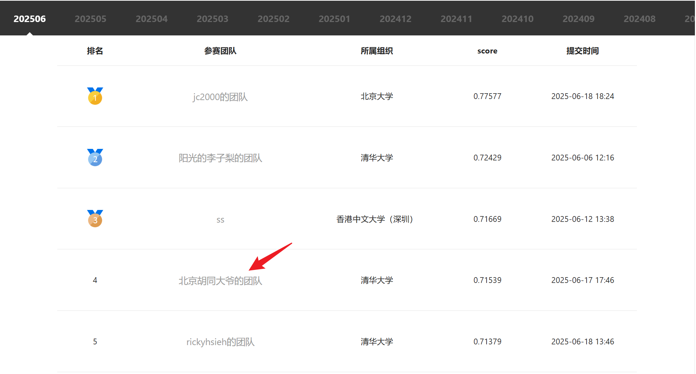

# Data Mining Project

**用户购买预测**

徐启鑫， 罗绍玮

## 数据分析与预处理
在这部分，我们介绍在进行特征工程之前对数据的统计和分析。
- `train.csv`里的**keys**: 
  ```py
    raw = pd.read_csv('train.csv')
    print(raw.info())
  ```
  发现原始数据集中共有29个**key**:
  ```
    Data columns (total 29 columns):
    #   Column                  Dtype  
    ---  ------                  -----  
    0   order_detail_id         int64  
    1   order_id                int64  
    2   order_total_num         float64
    3   order_amount            float64
    4   order_total_payment     float64
    5   order_total_discount    float64
    6   order_pay_time          object 
    7   order_status            int64  
    8   order_count             float64
    9   is_customer_rate        float64
    10  order_detail_status     float64
    11  order_detail_goods_num  float64
    12  order_detail_amount     float64
    13  order_detail_payment    float64
    14  order_detail_discount   float64
    15  customer_province       object 
    16  customer_city           object 
    17  member_id               float64
    18  customer_id             int64  
    19  customer_gender         float64
    20  member_status           float64
    21  is_member_actived       float64
    22  goods_id                int64  
    23  goods_class_id          int64  
    24  goods_price             float64
    25  goods_status            float64
    26  goods_has_discount      float64
    27  goods_list_time         object 
    28  goods_delist_time       object 
    dtypes: float64(18), int64(6), object(5)
    memory usage: 528.0+ MB
    ```
- 由于是一个购买预测任务，存在**时序关系**，因此我们需要查看`train.csv`里的**order_pay_time**字段的范围
  ```py
  print(raw['order_pay_time'].max())
  # 2013-08-31 23:59:59
  ```
  可推断我们的训练数据范围截至2013年8月，任务为根据截至2013年8月的数据去推断2013年9月的购买情况
- 我们还需要查看哪些字段存在**缺失值**
  ```py
  print(raw.isnull().sum())
  ```
  得到结果如下：
  ```
    [8 rows x 24 columns]
    order_detail_id                 0
    order_id                        0
    order_total_num                 0
    order_amount                    0
    order_total_payment             0
    order_total_discount            0
    order_pay_time                  0
    order_status                    0
    order_count                     0
    is_customer_rate                0
    order_detail_status             0
    order_detail_goods_num          0
    order_detail_amount             0
    order_detail_payment            0
    order_detail_discount           0
    customer_province            1139
    customer_city                1150
    member_id                       0
    customer_id                     0
    customer_gender           1671081
    member_status             1671081
    is_member_actived         1671081
    goods_id                        0
    goods_class_id                  0
    goods_price                   436
    goods_status                    0
    goods_has_discount              0
    goods_list_time                 0
    goods_delist_time               0
  ```
  对于存在缺失值的字段：
  - `customer_province`和`customer_city`缺失较少，且为字符串类型，我们选择用众数填充：
  ```py
  data['customer_province'].fillna(data['customer_province'].mode()[0], inplace=True)
  data['customer_city'].fillna(data['customer_city'].mode()[0], inplace=True)
  ```
  - `customer_gender`缺失较多，根据其定义，我们将缺失值均填充为0：
  ```py
  data = pd.DataFrame(raw.groupby('customer_id')['customer_gender'].last().fillna(0))
  ```
  - `goods_price`缺失较少，且为数值类型，我们选择用均值填充：
  ```py
  data['goods_price'].fillna(data['goods_price'].mean(), inplace=True)
  ```

## 算法实现与分析
在这部分，我们首先介绍**特征工程的实现**，然后介绍我们实现的**三种拟合算法**，最后汇报不同特征工程和算法在自己划分的**测试集上的准确率**以及对应的分析。

### 特征工程
我们根据购买经验人工选择特征，以下是一个概括：
1. **用户基本特征填充**：
   - 对于缺失的性别数据 (`customer_gender`)，使用 `0` 进行填充。

2. **用户行为特征提取**：
   - 提取每个用户的 **最后一次商品活动**（包括商品ID、状态、价格、是否打折等）。
   - 提取每个用户的 **最后一次订单活动**（如订单数量、金额、支付状态、订单时间等）。
   - 提取每个用户的 **最后一次会员状态**（如会员ID、会员状态和激活状态）。

3. **统计特征生成**：
   - 基于用户的商品行为，计算商品价格的 **均值、标准差、最大值、最小值**。
   - 基于用户的订单行为，计算 **订单支付金额的均值、标准差、最大值、最小值** 等统计特征。
   - 计算用户的 **总订单数量** 和 **商品数量**，以及与用户评分 (`is_customer_rate`) 相关的统计信息。

4. **时间特征**：
   - 提取订单支付时间 (`order_pay_time_last`) 的 **年月日时分秒** 等信息，用于捕捉时间模式。
   - 计算订单支付时间与特定时间（2012-10-11）之间的 **时间差**，以衡量订单的时效性。

5. **商品生命周期**：
   - 计算商品的 **上架时间（`goods_list_time_last`）和下架时间（`goods_delist_time_last`）** 之间的差异，获取商品的生命周期特征。

最终得到59个人为构建的特征。
### 数据集和测试集的设定
我们基于上述特征工程的结果测试了两种设定训练集和测试集的方式：
- 设置不同长度时间滑窗
- 将2013年8月之前的数据作为训练数据，2013年8月的数据作为label
#### 时间滑窗

主要参考了网站上大部分人的实现：对一些字段进行类型转换从而减少内存，之后对 payment 以及 goods 构建对应的 customer 数据，之后用不同的天数对这些数据进行一个 min/median/max/mean 等的特征。由于这部分代码是参考网上的教程，因此不做过多介绍。
这相比另一种方法一个优势是在构建 dataset 时只考虑到有交易成功的用户，而这些用户在完整的测试集里面只占了约47%。因此训练时间以及预测时都可以更快，占用的内存也更少，且训练时由噪声带来的影响也更低。

此种方法下得到的训练集和测试集数据为：

```py
test shape: (681436, 59) train shape: (681436, 60)
label
0.0    512617
1.0    168819
```

可以看到虽然 label 也是很不平衡，但相比另一种的方式已经比较平衡了，因为有效的数据在滑窗时数量增多了。

#### 8月作为分割
由于我们的预测任务是根据2013年9月前的数据去预测9月的结果，这启发我们可以**用2013年8月前的数据和8月的结果**去模拟这个任务。
```py
raw=pd.read_csv('train.csv')
train_raw=raw[raw['order_pay_time'] <= '2013-07-31 23:59:59']
raw.sort_values('order_pay_time', ascending=True, inplace=True)

label_raw=set(raw[raw['order_pay_time'] > '2013-07-31 23:59:59']['customer_id'].dropna())
```
此种方法下得到的训练集和测试集数据为：
```
test shape: (1435404, 59) train shape: (1435404, 60)
label
0    1412601
1      22803
```
<!-- 然而这方法只是在自己划分的训练/验证集上面有着能接受的结果，上传到网站上的 AUC 只有 ~0.5，还不如直接让他全猜 0。 -->
### 预测模型

我们选取了三种算法对数据进行拟合，分别是LightBGM, XGBBoost和K-Means。其中前两种算法均为掉包实现，K-Means则是自己编码实现。

### LightGBM

我们调用`lightgbm`包，对特征工程后的数据集进行拟合。
LightGBM（Light Gradient Boosting Machine）是一种基于梯度提升决策树（GBDT）算法的机器学习框架。与传统的 GBDT 算法不同，LightGBM 通过优化树的构建方式提高了训练速度和内存效率。它使用了直方图算法来加速训练过程，将连续特征分桶为离散区间，减少了计算复杂度。同时，LightGBM 采用了基于叶子节点的最佳分裂算法，而不是传统的按层级生长树的方式，这样能够提高模型的精度和效率。
我们的`LGBMClassifier`选取了如下参数：
```
clf = lgb.LGBMClassifier(
            num_leaves=2**5-1, reg_alpha=0.25, reg_lambda=0.25, objective='binary',
            max_depth=-1, learning_rate=0.005, min_child_samples=3, random_state=2021,
            n_estimators=2500, subsample=1, colsample_bytree=1,
        )
```
- 结果：在划分的测试集上达到了**0.71468**的AUC水平

### XGBoost
我们同时测试了调用`XGBoost`包的训练结果。
XGBoost（eXtreme Gradient Boosting）是一种高效的梯度提升决策树算法，广泛应用于分类、回归和排序任务。它通过优化传统的梯度提升算法，采用正则化、列和行抽样、并行计算等技术，显著提高了计算速度和模型精度。XGBoost 支持处理缺失值，能够自动对数据中的缺失部分进行合理填充，并在大规模数据集上表现出色。
我们选取的模型和训练参数如下：
```python
params = {
    'objective': 'binary:logistic',  
    'eval_metric': 'logloss',  
    'max_depth': 6,  
    'learning_rate': 0.1,  
}
num_round = 100  
```
- 结果：在划分的测试集上达到了**0.71539**的AUC水平
### K-means

**手动**实现了 K-means 聚类预测方法。整体流程为：
```py
- Initialize centroids
- do until convergence or max_iters:
    - Assign clusters
    - Update centroids
- Assign labels to clusters based on the most frequent label in each cluster
```

主要是最后一步把一个聚类任务转变成了预测任务。

同时，考虑到了使用上述第二种训练集和测试集的划分方式会出现大量的 NaN 特征，导致聚类效果变得很差，因此这里的训练/验证集选用的是时间滑窗特征工程后的数据。


### 分析
在这个部分，我们首先分析我们特征工程的效果，其次分析三种算法的效果，尤其是对异常结果的分析。
#### 特征工程分析
受到第三次作业的启发，我们测试两种特征工程的实现：
- 全部利用自己构造的特征，共59个
- 利用互信息算法从上述的59个特征中选取跟label最相关的30个特征
  
我们基于LightBGM测试这两种实现：

| 特征工程     | 算法     | 数据划分方式     | 测试集准确率     |
|---------|---------|---------|---------|
|全部59个   | LightBGM   | 8月分割   | 0.71468   |
| top30 / 59    | LightBGM   | 8月分割   | 0.69353   |

随着特征数量增加，特征增加带来的信息增益和冗余特征带来的难拟合问题为竞争关系，因此准确率关于特征数量的函数可能是一个**下凸曲线**，而极大值出现在59的右侧，因此减少59个特征至30个，表现为信息缺失导致模型能力下降

#### K-Means结果分析
在使用具有 10 个质心的 K-means 聚类算法进行训练后，观察到模型的预测结果几乎全为 0。尽管这在一定程度上可以理解，考虑到训练集的类别分布不平衡，但即使将质心数量调整至 128，模型依然仅预测类别 0。为了解析该问题，我利用主成分分析（PCA）和 t-SNE 技术对训练集数据进行了降维可视化。结果显示，大点表示质心的位置，小点表示训练集数据点及其对应的标签。


这一现象变得更加合理，因为标签数据的分布显然并非呈圆形，且可观察到，大部分标签为 1 的数据点与标签为 0 的数据点分别占据不同的区域，并且它们通过一条曲线连接。在这种数据分布下，基于圆形中心的聚类方法，如 K-means 和 K-center，无法有效地处理此类分布。进一步分析得知，由于采用的预测方法是将一个质心分类为该质心内出现频率最高的标签，而在数据存在类别不平衡的情况下，质心自然更倾向于聚集标签为 0 的数据点。
因此 K-means 在此数据集下出现全预测 0 的情况是可解释的。

#### 三种算法的横向比较
| 特征工程     | 算法     | 数据划分方式     | 测试集准确率     |
|---------|---------|---------|---------|
|全部59个   | LightBGM   | 8月分割   | 0.71468   |
|  全部59个   | XGBoost   | 8月分割   | 0.71539   |
|  全部59个   | K-Means   | 时间化窗   | ~0.5   |

可以发现XGBoost和LightBGM的效果接近，体现出开源工具包的一定优越性。

## 排行榜排名
截至**2025年6月19日**，我们实现的XGBoost算法排在总排行榜第四名，如果限定清华大学的参赛选手，我们排在**第二名**。


## 分工情况
- 徐启鑫：特征工程框架，LightBGM和XGBoost算法调包实现，报告撰写
- 罗绍玮：时间滑窗框架，手动实现K-Means，报告撰写
